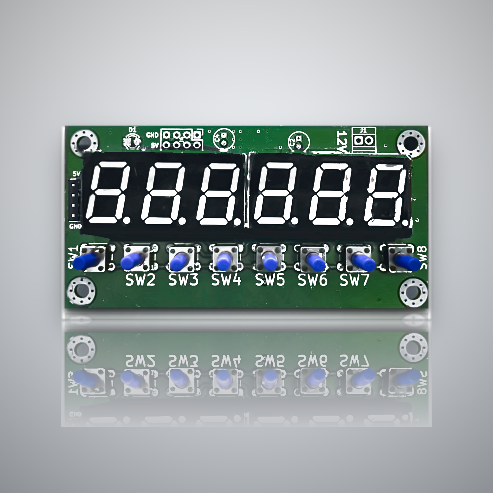

# TM1637 6-Digit LED Display & Button Module

**A six-digit LED readout with eight built-in buttons, driven from just two microcontroller pins.**

Micronode LLP, Pune, India — [micronode.in](https://micronode.in)

  

---

## Overview

This board puts a bright six-digit seven-segment display and eight tactile keys on one 90 x 45.25 mm PCB. The onboard TM1637 handles the display multiplexing and the key scan, so the whole module runs over two signal wires, CLK and DIO.

Feed it 12 V AC or DC on the screw terminal, connect the two signal wires plus ground, and you have a complete numeric front panel. The driver chip sits on the underside, leaving the front face flat for panel mounting behind a cut-out or bezel.

This repository holds the driver source, worked examples and the board documentation.

---

## Why two pins matters

On most embedded and industrial designs, I/O is the bottleneck long before processing power is. A six-digit display with a separate button row can consume fifteen to twenty GPIOs once segments, digit selects and a key matrix are accounted for.

Moving that onto the board changes what you can build:

- Runs from almost any controller, including small pin-limited parts
- Leaves your GPIO free for sensors, relays, motor drivers and comms
- Shorter harnesses, fewer conductors, fewer failure points on the line
- Retrofits into an existing cabinet without rewiring the panel

---

## Key features

- Decimal point on every digit, for values, counts, times and codes
- Eight keys along the front edge for menus, setpoints, mode, start, stop and reset
- CLK and DIO are ordinary GPIO — no dedicated peripheral or spare serial port
- 12 V AC or DC input, suited to control supplies and long cable runs
- Display, input and drive electronics on one board, so one line item on your BOM

---

## Applications

**Industrial**

- Production counters — units made, cycles completed, parts rejected, with manual increment and reset at the line
- Machine HMI front panels where a touchscreen is overkill
- Batch and job entry at the machine, without a separate terminal
- Fault and status code display, with keys to acknowledge or step through diagnostics
- Test, calibration and production-line fixtures showing live readings while a technician steps through stages
- Weighing, dosing and batching terminals
- Retrofit replacements for obsolete LED panels

**General**

- Counters, timers and stopwatches
- Voltmeters, ammeters and sensor readouts
- Scoreboards
- PIN and setpoint entry panels
- Menu-driven control for CNC, 3D printers and custom tools

---

## Hardware

| Item | Detail |
| --- | --- |
| Display | Six 7-segment digits, each with a decimal point |
| Driver | Titan Micro TM1637, SOP-20, on the underside |
| Interface | Two-wire serial, CLK and DIO |
| Buttons | Eight 6 mm tactile switches, SW1 to SW8 |
| Power input | 12 V AC or DC on the screw terminal, or 5 V directly |
| Auxiliary power | 5 V and ground on a 2 x 4 header, four positions each |
| Board | 90.00 x 45.25 mm, 1.6 mm FR-4, two layers |
| Mounting | 4 x 3.50 mm holes, 81.50 x 36.75 mm pitch, 4.25 mm from each edge |
| Component height | 8.65 mm above the board face |

### Display header

| Pin | Signal |
| --- | --- |
| 1 | 5 V |
| 2 | CLK |
| 3 | DIO |
| 4 | GND |

DIO is bidirectional, so the host pin must be able to switch between output and input.

---

## The driver

This is a full library, not a sample. It covers:

| Area | What it does |
| --- | --- |
| Numbers | Formatted integer output, right aligned, with leading-zero and blanking control |
| Characters | Character and text display using the segment table |
| Digits | Write an individual digit position, or raw segment bits |
| Decimal points | Set or clear the point on any digit |
| Time | Elapsed-time and clock formats using the decimal points |
| Buttons | Read the eight onboard keys |
| Display control | Blank and restore the display without losing its contents |

In most applications one call initialises the module and one call updates the reading.

### Porting

The driver is written in Embedded C with no dependency on any framework or vendor SDK. Every hardware access goes through a small port layer you write for your own device: drive CLK or DIO high or low, release DIO and read it back, and wait a few microseconds.

Everything above that layer — segment tables, number formatting, button decode — compiles unchanged. The same source runs on an 8051, STM32, PIC, RISC-V part or a Linux single-board computer.

---

## Repository contents

- Driver source, target independent
- Worked examples: counter, clock, setpoint entry, text display, key reading
- Documentation: pinout, board dimensions, digit and segment map
- Datasheet and STEP file

---

## Licence

Released under the MIT Licence. You may use this code in commercial products without restriction. See [LICENSE](LICENSE).

---

## Support

Boards, volume pricing and lead times: [micronode.in](https://micronode.in)

Open an issue for bugs or porting questions.
